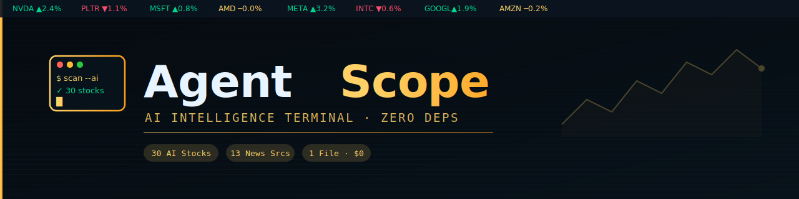

<div align="center">

# 🤖 AgentScope Pro



### **Professional AI Intelligence Terminal**

*A single-file, zero-build, zero-backend AI intelligence dashboard tracking the agentic AI ecosystem in real-time*

---

<!-- Project Status -->


<!-- Tech Stack -->


<!-- Deployment -->


**[🚀 Live Dashboard](https://agentscope.netlify.app)** | **[📝 Documentation](docs/AGENTSCOPE_PRO_V2_REFERENCE.md)** | **[🐛 Issues](https://github.com/SamoTech/AgentScope/issues)**

---

</div>

## ⚡ Why AgentScope?

<table>
<tr>
<td width="50%">

### 🚨 **The Problem**
Modern dashboards require:
- 500MB+ `node_modules`
- Complex build pipelines
- Docker containers
- Database setup
- Hours of configuration

</td>
<td width="50%">

### ✅ **The Solution**
AgentScope delivers:
- **1 file** (~1,568 lines)
- **0 dependencies**
- **0 build steps**
- **0 databases**
- **10 seconds** to start

</td>
</tr>
</table>

---

## 🎯 Live Dashboard Features

<div align="center">

| Feature | Description | Status |
|:--------|:------------|:------:|
| 📊 **Real-Time Stocks** | 30 AI equities across 7 segments | ✅ |
| 📰 **News Aggregation** | 13 curated AI/tech sources | ✅ |
| 📈 **Sentiment Analysis** | Keyword-based bullish/bearish detection | ✅ |
| 🏛️ **Bloomberg UI** | Ticker tape, heatmaps, sparklines | ✅ |
| 🎨 **Dark/Light Themes** | Toggle with `T` key | ✅ |
| ⌨️ **Keyboard Shortcuts** | R = refresh, T = theme, / = search | ✅ |
| 🔍 **Advanced Filtering** | 5D filter system (source/sentiment/time) | ✅ |
| 📡 **Auto-Refresh** | Every 5 minutes | ✅ |

</div>

---

## 🚀 Quick Start

```bash
git clone https://github.com/SamoTech/AgentScope.git
cd AgentScope
open index.html
```

**Zero install required!**

---

## 🛠️ Tech Stack

| Layer | Technology |
|:------|:-----------|
| 🎨 **Frontend** | Pure HTML, CSS, JavaScript (ES2020) |
| 🏛️ **Architecture** | IIFE module pattern (zero globals) |
| ⌨️ **Fonts** | JetBrains Mono + Outfit |
| 📈 **Charts** | Canvas 2D API (sparklines, heatmap) |
| ☁️ **Hosting** | Netlify / Cloudflare / GitHub Pages |
| 📊 **Stock Data** | FinancialModelingPrep API (FMP) |
| 📰 **News** | Hacker News API + RSS2JSON |

---

## 📄 License

**[MIT License](LICENSE)** © 2026 **SamoTech** (Ossama Hashim)

---

<div align="center">

**Made with ❤️ by [Ossama Hashim](https://github.com/SamoTech)** · Cairo, Egypt

</div>
