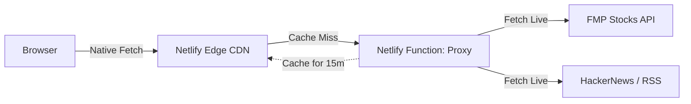

<div align="center">
  <h1>🤖 AgentScope Pro</h1>
  <p><strong>The Zero-Build AI Intelligence Terminal</strong></p>

  [](https://opensource.org/licenses/MIT)
  []()
  []()
  []()
  [](#-contributing-the-60-second-pr)

  <p>
    A Bloomberg-style dashboard tracking the Agentic AI ecosystem.<br>
    Built entirely with vanilla HTML/JS and a single Edge Function. 100% hackable.
  </p>
</div>

---

## ⚡ The Anti-Bloatware Terminal

The modern web developer ecosystem is suffering from JavaScript fatigue. We've been told you need 500MB of `node_modules`, complex Webpack configurations, and heavy Docker containers just to fetch a few APIs and render a dashboard.

**AgentScope proves otherwise.**

We built a real-time, institutional-grade AI market terminal using **pure HTML, CSS, and ES Modules**, protected by a single Serverless Edge proxy. It requires zero DevOps configuration to deploy, zero build steps to modify, and zero databases to maintain.

## 🏗 Architecture: The Edge-Cached Proxy

How do we serve hundreds of users daily without hitting the strict 250-request limit on free financial APIs? **Stale-While-Revalidate (SWR) Edge Caching.**

Clients never hit external APIs directly. Instead:
1. The browser requests data from our Netlify proxy (`/.netlify/functions/proxy`).
2. Netlify's Edge CDN intercepts the request. If cached, it serves it instantly (0ms).
3. If the cache is older than 15 minutes, Netlify serves the stale data instantly *while* seamlessly fetching live data from the APIs in the background to update the cache.



## ✨ Features

- **Real-Time AI Market Data:** Tracks 30 AI equities across Compute, Agents, Data, and Robotics.
- **Developer News Ingestion:** Parallel streaming of Hacker News and AI developer RSS feeds.
- **Bloomberg-Style UI:** Ticker tapes, heatmaps, canvas sparklines, and sentiment badges.
- **Client-Side Compute:** Sentiment analysis and trending topic extraction happen entirely in the browser to save server compute.
- **Zero-Build Ecosystem:** Just double-click `index.html` to start developing.

## 🚀 Quick Start (Local Dev)

Because there is no build step, getting started takes less than 10 seconds.

```bash
# 1. Clone the repository
git clone https://github.com/SamoTech/AgentScope.git
cd AgentScope

# 2. Add your free FMP API key
cp .env.example .env
# Edit .env and add FMP_API_KEY=your_key_here

# 3. Start the local serverless proxy
npx netlify dev
```
*Note: You can even just open `index.html` in your browser to view the UI, but the local Netlify dev server is required to proxy the API calls.*

## 🛠 Tech Stack

| Layer | Technology | Why We Chose It |
|-------|------------|-----------------|
| **Frontend** | Vanilla JS (ES Modules), HTML5 | Instant edits. No compilation. True to the open web. |
| **Styling** | Pure CSS Variables | No Tailwind or preprocessors required. |
| **Edge Cache** | Netlify Edge CDN | `s-maxage=900` protects our free-tier API limits perfectly. |
| **Backend** | Netlify Functions (Node 18) | A single `proxy.js` file hides our API keys from the browser. |
| **Data** | FinancialModelingPrep & Algolia | Generous free tiers for real-time market and news data. |

## 🤝 Contributing (The 60-Second PR)

Want to contribute to open-source but hate setting up local environments? AgentScope is designed for the **60-Second PR**.

Want to add a new AI startup to the tracker? 
1. Fork the repo.
2. Open `netlify/functions/proxy.js`.
3. Add the ticker symbol to the `tickers` array.
4. Submit your PR.

Check our [Issues tab](https://github.com/SamoTech/AgentScope/issues) for `good first issue` tags!

## 🗺 Roadmap

- [ ] **v2.1:** GitHub Trending AI Repositories integration.
- [ ] **v3.0:** Custom URL Hash Watchlists (Build and share your own terminal view like `?tickers=NVDA,PLTR`).
- [ ] **v4.0:** BYO-LLM (Bring Your Own LLM) - Enter your Anthropic key in `localStorage` for client-side news summarization.

## 💖 Sponsor & Support

If AgentScope saves you time or if you support the anti-bloatware engineering philosophy, consider supporting development:

- **GitHub Sponsors:** [github.com/sponsors/SamoTech](https://github.com/sponsors/SamoTech)
- **Star the Repo:** ⭐ It helps us attract more contributors!

---
*Made with ❤️ by [SamoTech](https://github.com/SamoTech) · Tracking the agentic AI revolution, one data point at a time.*