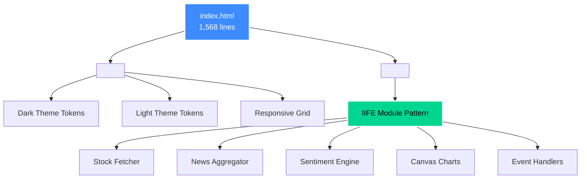
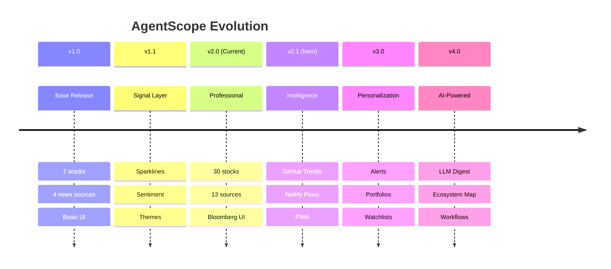

<div align="center">

# 🤖 AgentScope Pro

### **Professional AI Intelligence Terminal**

*A single-file, zero-build, zero-backend AI intelligence dashboard tracking the agentic AI ecosystem in real-time*

[](https://agentscope.netlify.app)
[](https://github.com/SamoTech/AgentScope)
[](https://github.com/SamoTech/AgentScope)
[](https://github.com/SamoTech/AgentScope)

[](https://github.com/SamoTech/AgentScope/stargazers)
[](LICENSE)
[](https://agentscope.netlify.app)
[](https://github.com/SamoTech/AgentScope/pulls)

[](https://github.com/sponsors/SamoTech)
[](https://github.com/SamoTech)
[](https://twitter.com/SamoTech)

---

### 🎯 **[Launch Dashboard →](https://agentscope.netlify.app)**

*Open `index.html` in any browser or deploy to Netlify/Cloudflare Pages in seconds — no installation required*

</div>

---

## ⚡ Why AgentScope?

<table>
<tr>
<td width="50%">

### 🚨 **The Problem**
Modern dashboards require:
- 500MB+ `node_modules`
- Complex build pipelines
- Docker containers
- Database setup
- Hours of configuration

</td>
<td width="50%">

### ✅ **The Solution**
AgentScope delivers:
- **1 file** (~1,568 lines)
- **0 dependencies**
- **0 build steps**
- **0 databases**
- **10 seconds** to start

</td>
</tr>
</table>

---

## 🎯 Live Dashboard Features

<div align="center">

| Feature | Description | Status |
|:--------|:------------|:------:|
| 📊 **Real-Time Stocks** | 30 AI equities across 7 segments | ✅ |
| 📰 **News Aggregation** | 13 curated AI/tech sources | ✅ |
| 📈 **Sentiment Analysis** | Keyword-based bullish/bearish detection | ✅ |
| 🏛️ **Bloomberg UI** | Ticker tape, heatmaps, sparklines | ✅ |
| 🎨 **Dark/Light Themes** | Toggle with `T` key | ✅ |
| ⌨️ **Keyboard Shortcuts** | R = refresh, T = theme, / = search | ✅ |
| 🔍 **Advanced Filtering** | 5D filter system (source/sentiment/time) | ✅ |
| 📡 **Auto-Refresh** | Every 5 minutes | ✅ |

</div>

---

## 🚀 Quick Start

<table>
<tr>
<td width="33%" align="center">

### 💻 **Local**
```bash
git clone https://github.com/SamoTech/AgentScope.git
cd AgentScope
open index.html
```
**Zero install required!**

</td>
<td width="33%" align="center">

### ☁️ **Netlify**
1. Fork repo
2. Connect to Netlify
3. Deploy (no build config)

**Live in 60 seconds!**

</td>
<td width="33%" align="center">

### 🔥 **Cloudflare**
1. Connect repo
2. Set build: `exit 0`
3. Deploy

**Zero-config deployment!**

</td>
</tr>
</table>

---

## 🆕 What's New in v2.0 Professional

<details open>
<summary><b>📊 Stock Tracking: 9 → 30 Tickers Across 7 Segments</b></summary>

| Segment | Tickers |
|---------|----------|
| **🤖 Pure AI** | AI (C3.ai), SOUN, BBAI, AITX, AMBA |
| **🖥 GPU/Infra** | NVDA, AMD, INTC |
| **☁️ Cloud** | MSFT, GOOGL, AMZN, ORCL, IBM |
| **⚡ Agents** | META, CRM, NOW, PEGA, NICE |
| **💡 Chips** | AVGO, ARM, QCOM, MRVL, ASML |
| **📊 Data/AI** | PLTR, SNOW, MDB, DDOG, S |
| **🦶 Robotics** | TSLA, IRBT |

</details>

<details>
<summary><b>📰 News Expansion: 4 → 13 Sources</b></summary>

| Source | Type | Coverage |
|--------|------|----------|
| **Hacker News** | API | Developer discussions, top AI stories |
| **TechCrunch AI** | RSS | Startups, funding, product launches |
| **VentureBeat AI** | RSS | Enterprise AI, agent frameworks |
| **AI News** | RSS | Research, industry analysis |
| **The Verge AI** | RSS | Consumer AI products |
| **Wired AI** | RSS | Long-form tech journalism |
| **MIT Technology Review** | RSS | Research-grade coverage |
| **ZDNet AI** | RSS | Enterprise technology |
| **InfoQ AI** | RSS | Engineering & architecture |
| **Analytics Vidhya** | RSS | ML/Data Science |
| **KDnuggets** | RSS | Data science, ML news |
| **AI Business** | RSS | Business applications |
| **DataScienceWeekly** | RSS | Curated newsletter |

</details>

<details>
<summary><b>🎆 Professional UI Enhancements</b></summary>

#### 📊 Sidebar Analytics (Desktop)
- 🔥 **Heatmap** — Top 8 movers with color-coded cells
- 📊 **Sector Performance** — Average % change bars per segment
- 📰 **Source Distribution** — Article counts by publisher with bar chart
- 🏷️ **Trending Topics** — Clickable AI keyword cloud extracted from all articles
- ⌨️ **Keyboard Shortcuts** — Quick reference panel

#### 📢 Bloomberg-Style Features
- **Ticker Tape** — Scrolling marquee with all 30 stocks (real-time % changes)
- **Market Status** — Live NYSE/NASDAQ open/closed indicator (Eastern Time)
- **8 KPI Cells** — Last Sync | Stocks Tracked | Articles Live | Top Gainer | Top Loser | Sources | Next Refresh

#### 🎯 Advanced Filtering
- **Global Search** — Searches stocks AND news simultaneously
- **Sort Controls** — % change ↓↑ | Price ↓↑ | A–Z
- **Quick Filters** — 🟽 Gainers | 🟽 Losers (one-click)
- **Sentiment Row** — 📈 Bullish | ➡ Neutral | 📉 Bearish
- **5D News Filter** — Source + Category + Sentiment + Search + Time

#### 🎨 Visual Design
- **Canvas Sparklines** — Gradient-filled trend charts on every stock card
- **Sentiment Badges** — Color-coded keyword-based analysis (📈 Bullish / 📉 Bearish / ➡ Neutral)
- **Category Tags** — 🤖 Agents / 🔬 Research / ⚙️ Infra / 💰 Funding / 🏛️ Policy
- **Loading Skeletons** — Shimmer animation (no blank flashes)
- **Staggered Fade-In** — Smooth card entrance animations
- **JetBrains Mono + Outfit** — Professional terminal aesthetic

</details>

---

## 💻 Architecture

<div align="center">



</div>

### Single-File Design

```
index.html (1 file, ~1,568 lines)
├─ <style>  — Complete design system with CSS custom properties
│   ├─ :root tokens (dark) + [data-theme="light"] overrides
│   ├─ Nav, Ticker Tape, KPI Bar, Sidebar
│   ├─ Stock cards, News cards, Heatmap, Charts
│   └─ Skeleton loaders, animations, responsive grid
│
└─ <script> — IIFE application (zero globals)
    ├─ CFG       — Config: 30 stocks, 13 sources, API keys
    ├─ STATE     — Single state object (stocks, news, filters)
    ├─ UTILS     — timeAgo, readTime, fmtPrice, fmtChange
    ├─ MARKET    — NYSE/NASDAQ hours detection
    ├─ SENTIMENT — Keyword-based classifier
    ├─ CATEGORY  — Auto-detect article categories
    ├─ TOPICS    — Extract trending keywords
    ├─ SPARKLINE — Canvas 2D charts with gradients
    ├─ STOCKS    — Fetch, filter, sort, render
    ├─ TAPE      — Scrolling ticker marquee
    ├─ HEATMAP   — Top movers visualization
    ├─ SECTORS   — Avg % per segment bars
    ├─ NEWS      — Parallel HN + RSS fetch + dedupe
    ├─ SIDEBAR   — Analytics widgets
    ├─ KPI       — Update dashboard metrics
    ├─ COUNTDOWN — Next refresh timer
    ├─ THEME     — Light/dark toggle
    └─ EVENTS    — Keyboard shortcuts + filters
```

---

## 🛠️ Tech Stack

<div align="center">

| Layer | Technology | Why? |
|:------|:-----------|:-----|
| 🎨 **Frontend** | Pure HTML, CSS, JavaScript (ES2020) | Zero compilation overhead |
| 🏛️ **Architecture** | IIFE module pattern (zero globals) | Clean namespace, no conflicts |
| ⌨️ **Fonts** | JetBrains Mono + Outfit | Professional terminal aesthetic |
| 📈 **Charts** | Canvas 2D API (sparklines, heatmap) | Native browser rendering |
| ☁️ **Hosting** | Netlify / Cloudflare / GitHub Pages | Instant zero-config deployment |
| 📊 **Stock Data** | FinancialModelingPrep API (FMP) | Free tier for real-time prices |
| 📰 **News** | Hacker News API + RSS2JSON | 13 curated AI sources |
| 🚫 **Build** | ❌ None — runs directly in browser | Open and develop instantly |
| 📦 **Dependencies** | ❌ None — zero npm packages | No supply chain vulnerabilities |

</div>

---

## 🔥 Why Developers Love It

<div align="center">

| Traditional Dashboard | 🚀 AgentScope Pro |
|:---------------------|:---------------------|
| `npm install` (10 mins) | **Open file** (1 sec) |
| 45,000 files in node_modules | **1 file total** |
| Webpack config hell | **No config needed** |
| Docker setup required | **Works anywhere** |
| 2GB project size | **~250KB total** |
| npm audit vulnerabilities | **Zero dependencies** |
| Build errors, cache issues | **Edit → Refresh → Done** |

### 🎯 **The 60-Second Contribution**
Want to add a feature? Edit `index.html`, refresh browser, submit PR. No setup. No builds. No friction.

</div>

---

## 📈 Roadmap



<details>
<summary><b>View Detailed Roadmap</b></summary>

### ✅ v1.0 — Base Release (Completed)
- FMP stock data (7 tickers)
- RSS news (4 sources: HN, TechCrunch, VentureBeat, AI News)
- Dark-themed two-panel UI with KPIs
- Segment + source filters
- Auto-refresh every 5 minutes

### ✅ v1.1 — Signal Layer (Completed)
- ✅ Canvas sparkline charts on stock cards
- ✅ Sentiment badges (bullish/bearish/neutral)
- ✅ Category tags (Agents/Research/Infra/Funding)
- ✅ Light/dark theme toggle
- ✅ Loading skeleton animation
- ✅ Top Mover KPI + countdown timer
- ✅ Cross-source news deduplication
- ✅ Read time estimates
- ✅ Keyboard shortcuts (R, T)
- ✅ Expanded to 9 stocks (added PLTR, ORCL)
- ✅ IIFE architecture with labeled sections
- ✅ Mock data fallback
- ✅ Search debounce (280ms)

### ✅ v2.0 — Professional (Current)
- ✅ **30 stocks** across 7 segments
- ✅ **13 news sources** (HN + 12 RSS feeds)
- ✅ **Sidebar analytics** (heatmap, sectors, source dist, topics)
- ✅ **Ticker tape** scrolling marquee
- ✅ **Market status** indicator (NYSE hours)
- ✅ **8 KPI cells** (sync, stocks, articles, gainer, loser, sources, refresh)
- ✅ **5-dimensional news filtering**
- ✅ **Sort controls** (% change, price, A-Z)
- ✅ **Gainer/Loser quick filters**
- ✅ **Sentiment filter row**
- ✅ **Policy category** (regulatory news)
- ✅ **Global search** (stocks + news)
- ✅ **Trending topics** sidebar widget

### 🔜 v2.1 — Intelligence Layer (Q2 2026)
- [ ] **GitHub Trending AI Repos** panel
- [ ] **Netlify Function** FMP proxy (hide API key)
- [ ] **Weighted sentiment** with confidence scores
- [ ] **PWA + offline mode** (service worker)
- [ ] **Custom domain** (e.g., agentscope.dev)

### 📅 v3.0 — Personalization (Q3 2026)
- [ ] **Price alerts** (localStorage persistence)
- [ ] **Portfolio tracker** (shares, P&L, holdings)
- [ ] **URL hash watchlists** (shareable custom tickers)
- [ ] **WebSocket real-time prices** (Finnhub)
- [ ] **User preferences** (default filters, watchlist)

### 🧪 v4.0 — AI-Powered (Q4 2026)
- [ ] **Claude-powered news digest** (3-sentence summary)
- [ ] **Batch sentiment via LLM** (confidence scores)
- [ ] **AI ecosystem map** (visual framework graph)
- [ ] **Earnings calendar** integration
- [ ] **Multi-agent workflow** tracking

</details>

---

## 👨‍💻 For AI Engineers

<div align="center">

### 🤖 **Extend AgentScope with AI**

Use this prompt with Claude, GPT-4, or Gemini to add features:

</div>

```markdown
You are building AgentScope Pro (https://github.com/SamoTech/AgentScope),
a single-file AI intelligence dashboard.

Constraints:
- Pure HTML/CSS/JS (no npm, bundler, framework)
- IIFE pattern (no modules)
- Must work by opening index.html directly
- Deploys to Netlify/Cloudflare with zero config

Current stack:
- 30 stocks (7 segments: Pure AI, GPU, Cloud, Agents, Chips, Data/AI, Robotics)
- 13 news sources (HN + 12 RSS feeds)
- FMP API (stocks) + RSS2JSON + HN Firebase API
- JetBrains Mono + Outfit fonts

Task: [YOUR FEATURE REQUEST]

Output:
- Complete updated index.html
- Preserve all existing functionality
- Add new IIFE section with /* ── LABEL ── */ header
- Match existing animation patterns
- Mobile responsive (480px, 768px)
- Graceful error handling
```

**📚 Full developer reference:** [docs/AGENTSCOPE_PRO_V2_REFERENCE.md](docs/AGENTSCOPE_PRO_V2_REFERENCE.md)

---

## 🔗 APIs & Data Sources

<div align="center">

| API | Purpose | Tier | Rate Limit | Cost |
|:---:|:--------|:----:|:-----------|:----:|
| 📈 **FMP** | Stock prices & changes | Free | 250/day | $0 |
| 🔥 **Hacker News** | Top AI stories | Free | Unlimited | $0 |
| 📡 **RSS2JSON** | RSS feed parsing | Public | ~1,000/day | $0 |
| 📰 **13 RSS Feeds** | AI news aggregation | Free | Unlimited | $0 |

**Total Monthly Cost:** `$0.00`

</div>

---

## 🤝 Contributing

<div align="center">

### ⚡ **The 60-Second PR Challenge**

Can you contribute to open source in under 60 seconds? With AgentScope, you can.

</div>

**How to Contribute:**

```bash
# 1. Fork & clone
git clone https://github.com/YOUR_USERNAME/AgentScope.git

# 2. Create branch
git checkout -b feature/add-new-ticker

# 3. Edit index.html (add ticker to CFG array)
# That's it. No npm install. No build. Just edit.

# 4. Test by opening index.html in browser

# 5. Commit & push
git commit -m "feat: add ANTHROPIC ticker to Pure AI segment"
git push origin feature/add-new-ticker
```

**🎯 Contribution Ideas:**

- ⭐ Add new AI news sources
- 📊 Add new stock tickers or segments
- 🎨 Improve UI/UX design
- 🐛 Fix bugs or improve error handling
- 📝 Improve documentation
- ⚡ Performance optimizations
- 🌍 Internationalization (i18n)

**📌 Issues labeled `good first issue`:** [View Issues](https://github.com/SamoTech/AgentScope/issues?q=is%3Aissue+is%3Aopen+label%3A%22good+first+issue%22)

---

## 💖 Sponsor & Support

<div align="center">

**If AgentScope saves you time or inspires your next project, consider supporting its development!**

[](https://github.com/sponsors/SamoTech)
[](https://paypal.me/SamoTech)
[](https://buymeacoffee.com/samotech)

### 🌟 **Your Support Enables:**

✨ New features & enhancements  |  🐛 Bug fixes & maintenance  |  📚 Documentation improvements  |  🌐 Community support

</div>

---

## 📄 License

<div align="center">

**[MIT License](LICENSE)** © 2026 **SamoTech** (Ossama Hashim)

*Permission granted to use, copy, modify, merge, publish, distribute, sublicense, and/or sell copies of this software.*

</div>

---

## 📚 Learn More

<table>
<tr>
<td width="50%">

### 📄 **Documentation**

- **📚 Pro v2 Reference**  
  [docs/AGENTSCOPE_PRO_V2_REFERENCE.md](docs/AGENTSCOPE_PRO_V2_REFERENCE.md)
  - Complete architecture breakdown
  - Design system tokens
  - AI development prompt with 9 examples
  - Component reference
  - Function documentation

- **📄 v1.1 Analysis** *(legacy)*  
  [docs/AGENTSCOPE_ANALYSIS_AND_PROMPT.md](docs/AGENTSCOPE_ANALYSIS_AND_PROMPT.md)
  - v1.0 → v1.1 upgrade analysis
  - 14 identified issues + solutions
  - 15 enhancement proposals

</td>
<td width="50%">

### 🔗 **Quick Links**

- 🚀 **[Live Dashboard](https://agentscope.netlify.app)**
- 💻 **[GitHub Repo](https://github.com/SamoTech/AgentScope)**
- 🐛 **[Issues](https://github.com/SamoTech/AgentScope/issues)**
- 💬 **[Discussions](https://github.com/SamoTech/AgentScope/discussions)**
- 📦 **[Releases](https://github.com/SamoTech/AgentScope/releases)**
- 📚 **[Wiki](https://github.com/SamoTech/AgentScope/wiki)**

</td>
</tr>
</table>

---

## ⭐ Star History

<div align="center">

**If you find this project useful, please consider giving it a star!** ⭐

[](https://star-history.com/#SamoTech/AgentScope&Date)

</div>

---

<div align="center">

## 👋 **Connect With Us**

[](https://github.com/SamoTech)
[](https://twitter.com/SamoTech)
[](https://linkedin.com/in/samotech)
[](mailto:samo.hossam@gmail.com)

---

**Made with ❤️ by [SamoTech](https://github.com/SamoTech)** · Cairo, Egypt · February 2026

*Tracking the agentic AI revolution, one data point at a time.* 🚀🤖

[](https://visitorbadge.io/status?path=https%3A%2F%2Fgithub.com%2FSamoTech%2FAgentScope)

</div>